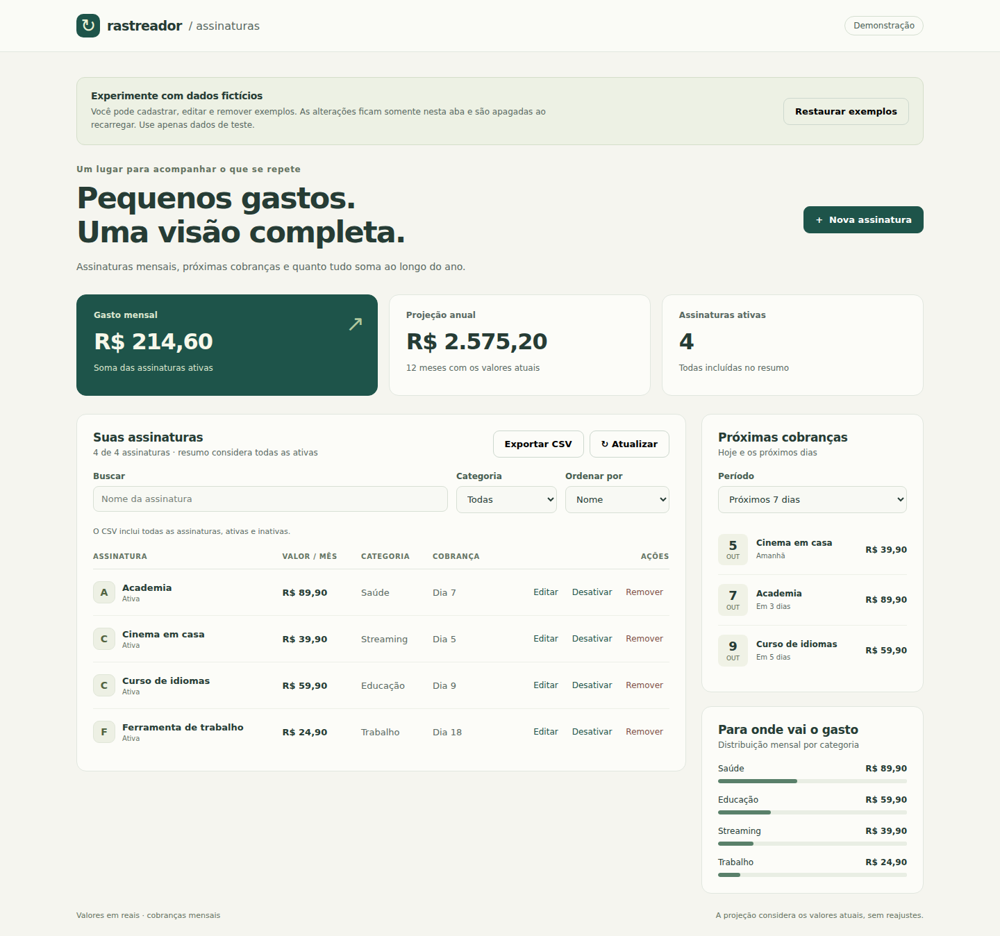
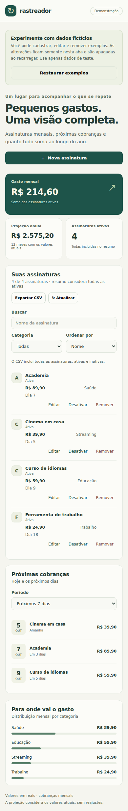

# Demonstração pública

A demonstração usa o mesmo painel da aplicação Go e quatro assinaturas fictícias. O aviso no início da página identifica o modo e explica quando os dados são apagados.



## Comportamento

| Aspecto | Aplicação local | Demonstração |
| --- | --- | --- |
| Execução | Go e PostgreSQL pelo Docker | HTML, CSS e JavaScript |
| Dados iniciais | Banco existente ou lista vazia | Quatro exemplos fictícios |
| Persistência | PostgreSQL | Memória da página |
| Recarregar | Mantém os registros | Restaura os exemplos |
| Cálculos e CSV | API Go | JavaScript no navegador |
| Compartilhamento | Mesma instância usa o mesmo banco | Cada aba/visitante tem seus próprios exemplos |
| Calendário | Fuso `TZ` do servidor | Data civil do navegador do visitante |

Cadastro, edição, ativação/desativação, busca, filtros, ordenação, remoção, próximas cobranças e CSV podem ser experimentados na demonstração. O botão **Restaurar exemplos** reinicia os dados e limpa a busca, a categoria e a ordenação da lista.

As assinaturas não são enviadas a um servidor. Não há cookies, `localStorage` ou `sessionStorage` para salvar esses dados. Recarregar ou fechar a aba apaga as alterações. Use apenas dados fictícios.

## Gerar e conferir localmente

Requisito: Node.js 24, sem instalar pacotes npm.

```bash
node --test testes/*.test.mjs
node scripts/gerar-demo.mjs
node scripts/servir-demo.mjs
```

Abra `http://localhost:4173`. Use Ctrl+C para encerrar a prévia.

O gerador recria `public/`, uma pasta de saída ignorada pelo Git. Ele copia somente os recursos necessários do painel, gera o HTML com o modo de demonstração, um arquivo de cabeçalhos e uma página 404. Não coloque arquivos pessoais nessa pasta gerada.

O HTML usado pela aplicação Go não recebe a marca de demonstração nem dados de exemplo automaticamente. O Node.js é necessário somente para testar, gerar ou servir a demonstração, não para rodar a API Go.

## Publicar no Cloudflare Pages

A demonstração está publicada em [rastreador-assinaturas.pages.dev](https://rastreador-assinaturas.pages.dev/). A tabela abaixo registra a configuração usada no projeto.

No painel do Cloudflare, crie um projeto **Pages** conectado ao repositório `murilo-mg/rastreador-assinaturas`. Escolha um nome disponível e use:

| Configuração | Valor |
| --- | --- |
| Plano | Free |
| Branch de produção | `main` |
| Framework preset | None |
| Build command | `node scripts/gerar-demo.mjs` |
| Build output directory | `public` |
| Root directory | Raiz do repositório, sem subpasta |
| Variável `NODE_VERSION` | `24` |
| Variável `SKIP_DEPENDENCY_INSTALL` | `true` |

Não são necessárias variáveis `DB_*`, senhas ou tokens na demonstração. A saída é inteiramente estática e não inclui Functions. A documentação do Cloudflare informa que requisições a arquivos estáticos são gratuitas e ilimitadas; o plano Free tem limites de builds e outros recursos.

O endereço publicado é [rastreador-assinaturas.pages.dev](https://rastreador-assinaturas.pages.dev/). Em 5 de outubro de 2026, a página abriu e carregou o aviso de demonstração, os quatro exemplos fictícios e os indicadores do painel.

Os cabeçalhos gerados em `public/_headers` foram conferidos na resposta HTTP do Cloudflare Pages em 5 de outubro de 2026. A resposta foi `HTTP/2 200` e incluiu CSP com `connect-src 'none'` e `frame-ancestors 'none'`, `X-Content-Type-Options: nosniff`, `X-Frame-Options: DENY`, `Referrer-Policy: no-referrer`, `Permissions-Policy` bloqueando câmera, microfone e geolocalização, e `Cache-Control: no-store`. O site é estático e não chama a API.

Referências oficiais consultadas em 4 de outubro de 2026:

- [Publicar HTML estático](https://developers.cloudflare.com/pages/framework-guides/deploy-anything/)
- [Configuração de build](https://developers.cloudflare.com/pages/configuration/build-configuration/)
- [Versão do Node e instalação automática](https://developers.cloudflare.com/pages/configuration/build-image/)
- [Preço de requisições estáticas](https://developers.cloudflare.com/pages/functions/pricing/)
- [Limites do plano gratuito](https://developers.cloudflare.com/pages/platform/limits/)

<details>
<summary>Demonstração no celular</summary>



</details>
